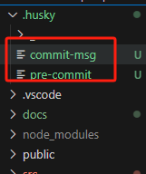
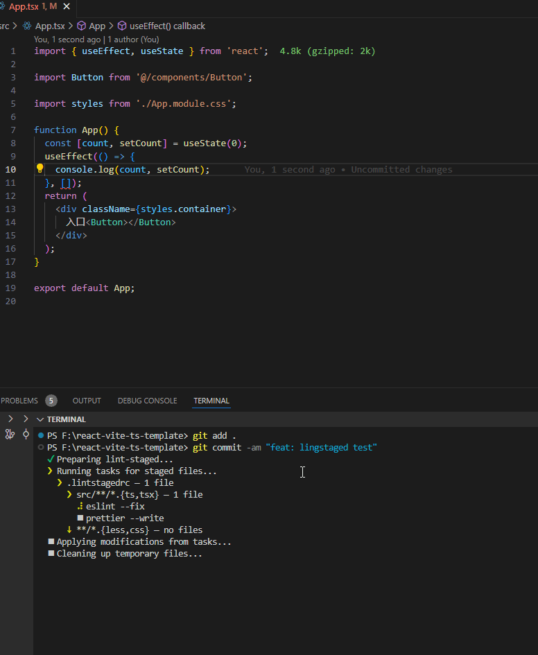

# React + TypeScript + Vite

React + TypeScript + Vite + React Router + React Redux项目脚手架模版。

- 很好的集成了Code Lint周边工具，支持对TS，CSS，LESS等文件的自动格式化。
- 支持PC 和 H5
- 内置目录结构

## 一、环境

- node: >=20.0.0

## 二、运行

- npm install
- npm run dev

## 三、Code Lint配置及介绍

在开始介绍Code Lint配置前，需要准备以下工作：

需要在vscode安装以下插件：

- eslint
- prettier
- editorconfig
- Stylelint

下图是Code Lint必备插件：

code lint相关工具及其作用

- eslint。负责规范并校验js代码的编写，本身不具备自动格式化功能
- commit lint。负责校验commit msg是否符合规范
- stylint。负责规范并校验css/scss/less 代码的编写。
- prettier。保存代码自动格式化
- editor config。确保大家编辑器的风格统一，比如空格啥的。确保编辑器安装了editorconfig插件，比如vscode需要安装EditorConfig
- lint stage
- husky

### 3.1 vscode 配置

vscode基础配置，比如保存代码自动格式化等基础配置，均需要在./vscode/settings.json文件修改，同时这份文件需要提交上去，确保团队基础配置统一。

### 3.2 eslint + prettier

需要确保vscode安装了eslint和prettier插件。

eslint负责规范并校验js代码的编写，本身不具备自动格式化功能。ctrl+s保存代码时，prettier会自动格式化代码，比如下图，eslint提示import语句的顺序不对，同时提示useEffect，useState没有使用到。当ctrl + s保存代码时，prettier会自动格式化这些代码。

> 如果项目使用的ESLint可能会出现与 Prettier 的格式化规则冲突的情况。为了避免这种情况,可以使用 eslint-config-prettier 来禁用所有与 Prettier 冲突的 ESLint 规则

### 3.3 stylelint + prettier

需要确保vscode安装了Stylelint和prettier插件。

stylelint负责规范并校验css/scss/less 代码的编写，本身不具备自动格式化的功能呢。ctrl + s保存代码时，prettier会自动格式化代码，比如下图，stylelint提示height的位置不对，因此保存代码时，prettier会自动调整这些规则的顺序。

### 3.4 editorconfig

需要确保vscode安装了editorconfig for vscode插件，并在根目录下创建.editorconfig文件。

主要作用：

- 确保团队成员在不同的编辑器中使用相同的缩进、换行符、字符编码等规则。
- 避免因代码风格不一致导致的冲突或混乱

比如`indent_size`指定缩进的大小(2个空格或者4个空格)

比如下面是`indent_size`指定为2时，按tab键的空格数

比如下面是`indent_size`指定为4时，按tab键的空格数

### 3.5 lintstaged + husky

lint-staged 是一个工具，它允许你在 Git 提交前对暂存区（即通过 git add 的文件）运行预定义的代码检查任务，如 ESLint、Prettier 等。它的核心功能是只对暂存区的文件进行检查，避免对未修改的文件进行不必要的检查

为什么使用 lint-staged：

- 高效的代码检查：只对暂存区的文件进行检查，避免了全量检查，提高了效率。
- 提高代码质量：在提交前自动检查代码，减少低质量代码被提交的概率。
- 集成流畅：与 husky 等工具结合，能够自动化工作流，减少手动操作

执行npm install后，默认会在项目根目录下新建.husky文件目录，需要在.husky下面新增两个文件，才能使得git commit时自动跑lint校验。

- .husky/commit-msg
- .husky/pre-commit

如下图所示，当代码中存在错误时，代码就没法提交上去

